# SnabDB — Приложение для отдела снабжения, разработанное на PyQt5 с использованием PostgreSQL.

## О проекте
Проект написан для корпоративного пользования реальной фирмы и представляет собой базу данных, написанную с помощью фреймворка PyQt5 на базе PostgreSQL. Основная цель — создание базы данных под требования отдела снабжения для хранения и передачи информации по корпоративным закупкам.

## Возможности
- **Добавление строк** — с автоматической установкой текущей даты и времени.
- **Удаление строк** — удаление выбранной строки из таблицы.
- **Быстрый выбор значений ячеек** — с помощью раскрывающихся списков (В таких колонках, как: "Срочность", "Участок", "Ответственный", "Статус")
- **Загрузка PDF-файлов в таблицу** — с помощью кнопки "Загрузить документ"
- **Удаление PDF-файлов из таблицы** — правой кнопкой мыши с контекстным меню
- **Фильтрация по колонкам** — с помощью раскрывающихся списков с уникальными значениями из фильтрующегося столбца
- **Реагирование на горячие клавиши Ctrl+Z** — Для отмены последнего действия
- **Подтверждение о сохранении изменений** — Перед закрытием программа спрашивает о том, требуется ли сохранить внесённые изменения

## Особенности интерфейса
- **Автоматическое заполнение даты и времени** — при добавлении строки
- **Цветовая индикация** для колонки "Этап":
  - Красный — "Не просмотрено"
  - Зелёный — "Доставлено"
- **Фильтрация** — по дате, товару, ответственному и этапу
- **Загрузка PDF** — через диалог выбора файла
- **Открытие PDF** — по нажатию на кнопку (если файл уже загружен)
- **Контекстное меню** — для удаления загруженного документа
- **Горячая клавиша Ctrl+Z** — для отмены последнего действия

## Работа с базой данных
- **СУБД**: PostgreSQL
- **Структура БД**: таблица tasks с полями, соответствующими колонкам таблицы
- **Сохранение данных**: автоматически при закрытии приложения (с подтверждением)
- **Загрузка данных**: при открытии приложения
- **Соединение**: через встроенный драйвер QPSQL (PyQt5)

## Технологии
- **Python** 3.11+
- **PyQt5 5.15.11** — графический интерфейс
- **PostgreSQL 14+** — для работы с данными
- **Poetry** — управление зависимостями

## Управление заказами
- **Добавление заказов** — одной кнопкой с автоматической датой и пустыми полями для заполнения
- **Удаление заказов** — выделение строки и нажатие "Удалить"
- **Изменение статуса** — через выпадающий список в колонке "Этап"
- **Прикрепление файлов** — загрузка PDF-документов в таблицу
- **Отмена действий** — через Ctrl+Z


## Результат:
### Основной вид таблицы (при добавлении новых строк)
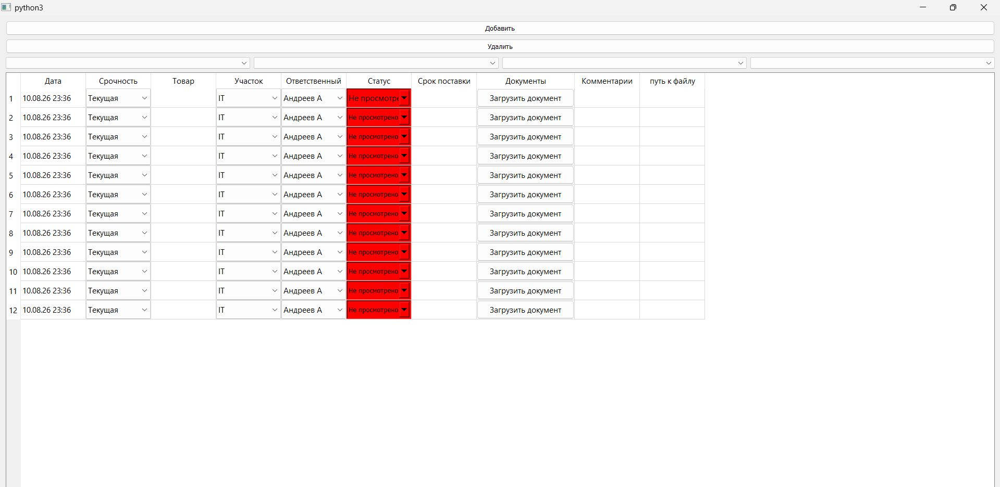

### Выпадающие списки
#### Колонка "Срочность"
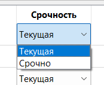
#### Колонка "Участок"
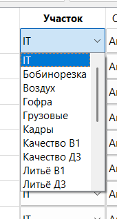
#### Колонка "Ответственный"
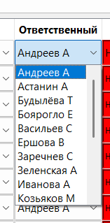
#### Колонка "Статус"
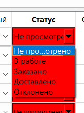

### Подсказки-названия фильтров
#### Фильтр по колонке "Дата"
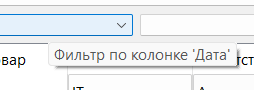
#### Фильтр по колонке "Ответственный"
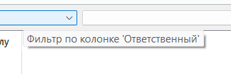
#### Фильтр по колонке "Товар"
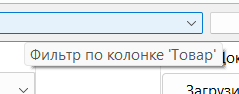
#### Фильтр по колонке "Статус"
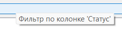

### Фильтрация (с уникальными значениями, которыми уже заполнена колонка)
#### Уникальные значения в фильтре по колонке "Статус"
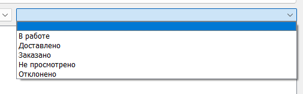
#### Уникальные значения в фильтре по колонке "Ответственный"
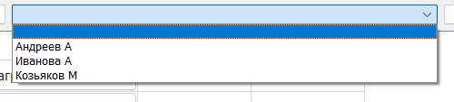
#### Уникальные значения в фильтре по колонке "Товар"
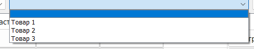
#### Уникальные значения в фильтре по колонке "Дата"
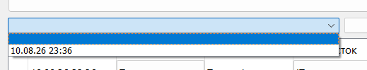

### Добавление PDF-документа в колонку "Документы"
#### При добавлении первого же документа, колонка "путь к файлу" скрывается, чтобы пользователь случайно не мог повредить сохранившейся путь
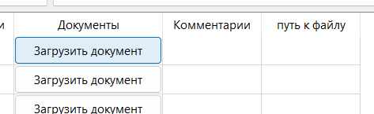
#### Видит только PDF-формат
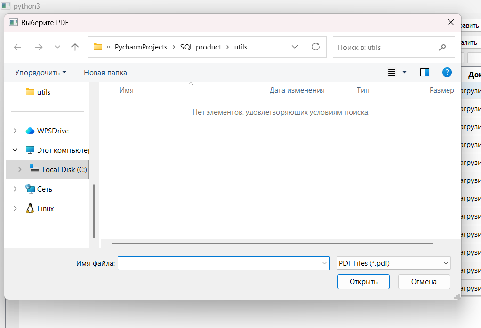
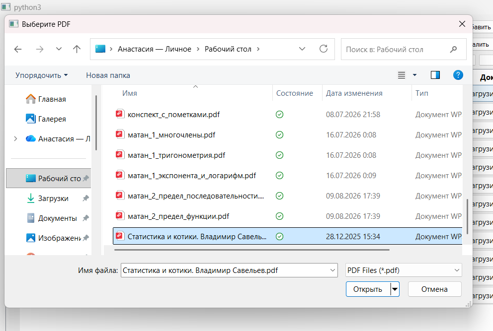
#### Кнопка поменяла своё название на название подгруженного документа, колонка "путь к файлу" скрылась
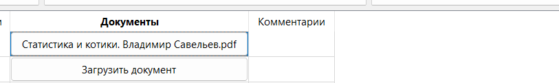
#### Правой кнопкой мыши можно удалить файл, после чего подгрузить другой файл
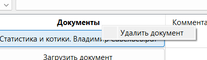
#### При нажатии левой кнопкой мыши на ячейку с файлом - файл откроется
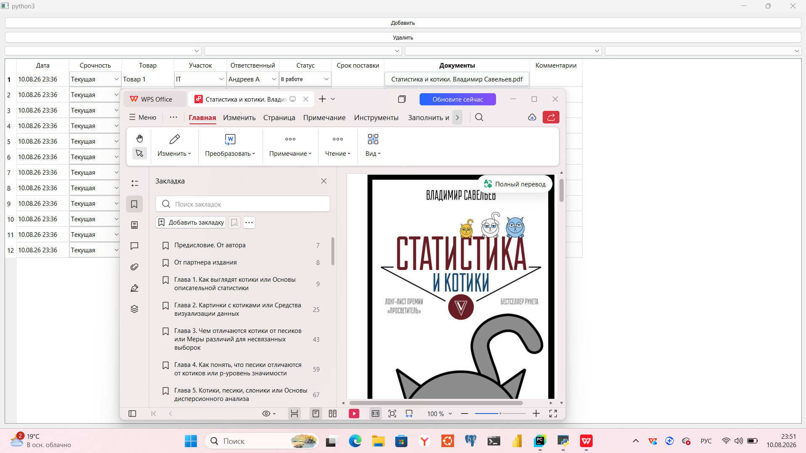

### Цветовая индикация колонки "Статус"
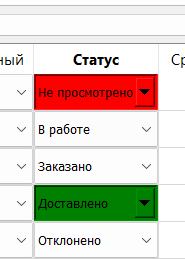

### Перед закрытием программа уточняет, требуется ли сохранить свежие изменения
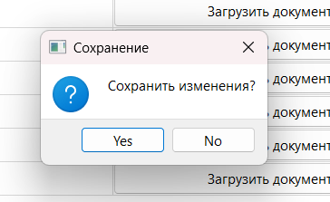

### Как выглядит ярлык программы
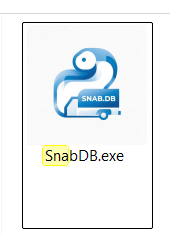

## Установка и запуск

***Клонирование проекта:***
```
git clone https://github.com/Anastasia-0-Iva/SnabDB.git
cd SnabDB
```

***Создание виртуального окружения:***
```
# Windows
python -m venv venv
.\venv\Scripts\activate

# Linux/macOS
python3 -m venv venv
source venv/bin/activate
```

***Установка зависимостей:***
```
poetry install
```